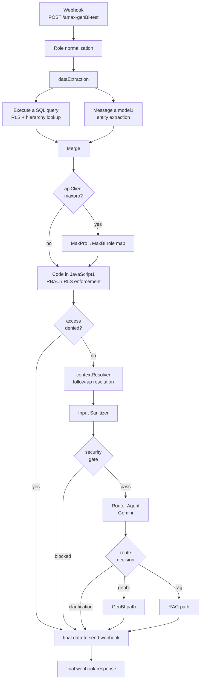
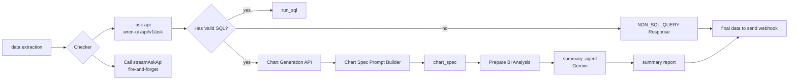
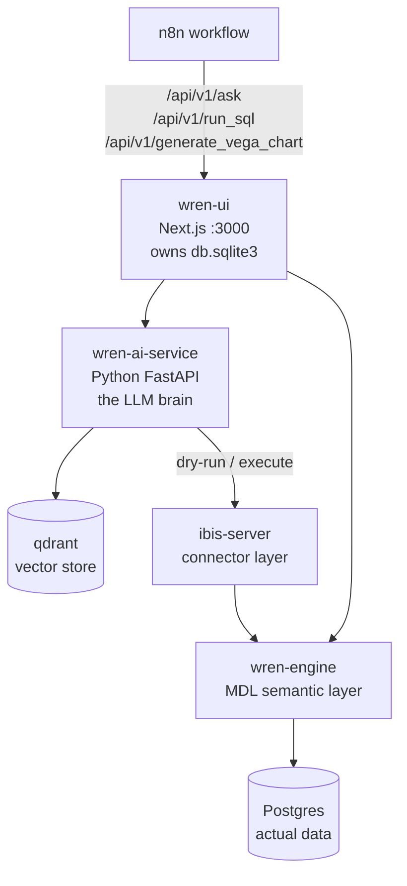
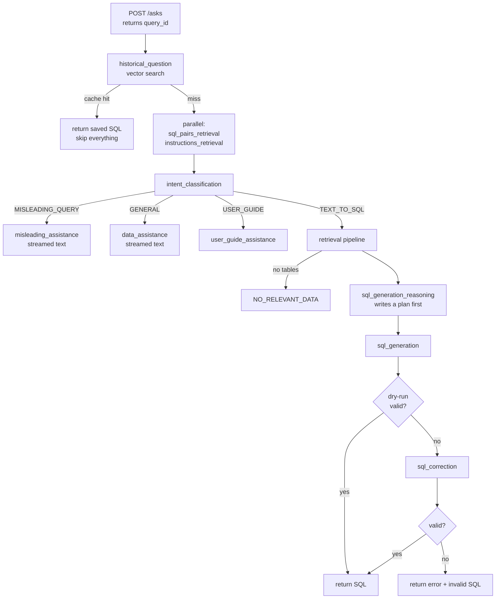

# A-MAX GenBI Bot — Architecture & Flow

**Source:** `6aug.json` (n8n workflow, 97 nodes — 6 disabled, 17 sticky notes)
**Wren backend:** `migration_backup/wren-ai-service` (full Python source present)

---

## 1. What it is

A chat assistant for A-MAX Insurance, hosted as a single n8n workflow. A browser widget POSTs a
question to a webhook; the workflow identifies the user, enforces row-level security, classifies
the question, routes it to one of two answering engines, and returns structured JSON
(text + insights + chart + citations).

**Two answering engines:**

| Engine | Answers | Backed by |
|--------|---------|-----------|
| **GenBI** | "What is 19th Street revenue for 2024?" — numbers from our database | Wren AI (text-to-SQL) |
| **RAG** | "What documents are needed for a POP discount?" — insurance knowledge | OpenWebUI over uploaded docs |

The webhook is `POST /amax-genBi-test`, `responseMode: responseNode`, CORS open.

---

## 2. Top-level flow



---

## 3. Stage by stage

### Stage 1 — Identity & role normalization

**`Code in JavaScript3`** is the first real node. It normalizes whatever role string the widget sent
into one of five canonical levels:

```
hod > sod > rsm > dsm > agent
```

Role aliases are matched loosely (`"Regional Sales Manager"`, `"RSM"`, `"rsm"` all → `rsm`).
It emits `rls_mapping`:

```js
rls_mapping: {
  role, level, apply,
  column,      // sod | rsm | dsm | agentname — the DB column that scopes this user
  isStoreMgr   // true only for "Store Manager"
}
```

Store Manager is deliberately aliased to `agent` level, but flagged separately via `isStoreMgr` —
they are agent-level in clearance but their *scope* is a whole store, not one person.

HOD gets `rls_flag = false` and bypasses RLS entirely.

**`dataExtraction`** (Set) then flattens the request into working fields: `question`, `questionId`,
`sessionId`, `email`, `userName`, `userRole`, `userOrg`, `conversationContext`, `isFollowUp`,
`apiClient`, `rls_flag`, `rls_mapping`.

### Stage 2 — Two things happen in parallel

`dataExtraction` fans out. Both branches rejoin at `Gathering Location and Question` (Merge).

**Branch A — the RLS/hierarchy query** (`Execute a SQL query`, Postgres)

One query does three jobs:

1. Loads the cached WrenAI value lists from `wren_ai.rls_caching` (all distinct company names,
   agency names, agent names, sod/rsm/dsm values) — used later for fuzzy matching.
2. Resolves the user's real name from their email via `vw_master_sales_hierarchy`
   (`email_resolved_name`) — because the `userName` the widget sends is not trustworthy.
3. Builds `rls_mapping` — the arrays defining what this user is allowed to see:
   `sod`, `rsm`, `dsm`, `agentname`, `empcode`, `agents`, `agencyname`, `agencyid`.

Plus a separate `employeecode` column — the current user's own code, picked by role
(`sodcode` / `dsmcode` / `rsmcode` / `empcode`).

For **store managers** only, three of those arrays (`agentname`, `empcode`, `agents`) get their
team appended from `wren_ai.rls_caching.store_manager`, because a store manager's agents do not
appear under them in `vw_master_sales_hierarchy`.

**Branch B — entity extraction** (`Message a model1`, Gemini 2.5 Flash)

Decides whether the question contains proper nouns that need resolving against the DB:

```json
{"skip": false, "search": ["19th Street", "Maria Garcia"]}
```

Metrics, time periods, and hierarchy role words are deliberately excluded.

### Stage 3 — API client branch

`MaxBI and MaxPro Checker` (IF on `apiClient == "maxpro"`). MaxPro sends its own role vocabulary,
so `MaxPro to MaxBI Mappings` translates it (`OfficeManager` → Store Manager, `ROM` → RSM,
`ZoneManager` → DSM, `N/A` → SOD) before the security node sees it.

### Stage 4 — RBAC / RLS enforcement ← the security boundary

**`Code in JavaScript1`** is the single node that decides what the user may ask. Everything
security-relevant lives here.

1. **Fuzzy match** each search term against the cached DB value lists using Levenshtein distance
   with an adaptive threshold (≤5 chars → 1, ≤8 → 2, else 3). Substring containment scores 0.
   A leading-number guard stops "10 Street" matching "1st Street".
   *The column the winning value lives in becomes the assigned column.*

2. **Clearance check** — deny if the matched column sits above the user's level
   (a DSM asking about an RSM).

3. **Peer check** — deny if the user matched their own column but a different person's value
   (a DSM asking about another DSM).

4. **Scope check** — the matched value must appear inside the user's own hierarchy arrays.
   An RSM cannot query a DSM who reports to a different RSM.

5. **Build RLS clauses** —

   | User | Filter applied |
   |------|----------------|
   | any | `ref_source_system_cd = <org>` |
   | sod/rsm/dsm | `<their column> = <their name>` |
   | agent | `agent_name = <name>` + `employee_code = <code>` |
   | store manager | `actagencyname IN (<their agencies>)` |

6. **Append the restriction to the question text**:

   ```
   [Mandatory access restriction - apply as a hard WHERE filter ...: dsm = "Jane Smith"]
   ```

7. **Inject empcode hints** — when a manager asks about a named agent, the agent's
   `employee_code` is appended so the SQL generator filters on the code, not the name.

Output: `{ access_denied, matched_response, updated_question, previous_response }`.
`Switch2` sends denials straight to the response assembler.

> **Note on the mechanism:** RLS is enforced by *telling the SQL generator in natural language* to
> add a WHERE clause. It is prompt-based, not a database-level guarantee. If Wren ignores the
> directive, the restriction fails silently. See §6.

### Stage 5 — Context resolution & security gate

**`contextResolver`** resolves follow-ups against `conversationContext`, producing
`resolvedQuestion`, `isFollowUp`, and `contextSummary`. "What about March?" becomes
"What are the tier goals for Riverside in March?"

**`Input Sanitizer`** → **`security gate`** (IF on `securityBlocked`) — blocked requests get a
canned response and a security log entry.

### Stage 6 — Router

**`Router Agent`** (Gemini agent, with a fallback model) classifies into four routes and also acts
as a second security layer — it rejects SQL injection and prompt injection patterns before they
reach either engine.

| Route | Meaning |
|-------|---------|
| `genbi` | numbers from our data |
| `rag` | insurance knowledge |
| `clarification_needed` | question spans both, or is too vague |
| `rejected` | security violation |

`Parse` → `route_code_output` normalize the agent's JSON, then `Switch` fans out.

### Stage 7a — GenBI path



- `ask api` POSTs the RLS-injected question to Wren and gets SQL back.
- `Call streamAskApi` runs in parallel as a sub-workflow to stream Wren's reasoning to the widget.
- `Has Valid SQL?` guards the case where Wren returns prose instead of SQL.
- `run_sql` and `Chart Generation API` fire **in parallel**. `run_sql`'s success output is
  deliberately left disconnected — it is fire-and-forget, and the chart branch drives the rest.
- `chart_spec` sanitizes and repairs the Vega-Lite spec in plain JS (the LLM that used to do this
  is disabled — charts render better without it).
- `summary_agent` writes the narrative answer over the returned rows.

### Stage 7b — RAG path

```
RAG Messages Prompt Builder → RAG Message Cleaner LLM → buildRagMessages
   → knowledgeBaseApi (OpenWebUI) → fetchCollectionFiles
   → Citation Prompt Builder → Citation Resolver LLM → citation_code
   → outputAndCitations → final
```

Citations are resolved by matching the model's quoted snippets back to the source files returned by
`fetchCollectionFiles`.

### Stage 8 — Response assembly

Every terminal branch converges on **`final data to send webhook`** (Set), which normalizes the
payload shape, then `final webhook response` returns it and `Prepare Execution Log` writes the run
to Postgres.

---

## 4. Cross-cutting subsystems

**Error handling.** Almost every node's error output fans into a single chain:

```
Error Classifier Prompt Builder → Error Classifier LLM (Gemini)
  → format_error → error_explainer_agent (Gemini) → final response
                 → log to error_logs
```

So a raw Postgres or HTTP error is turned into a user-readable explanation rather than a stack trace.

**Timing telemetry.** `capture_start_time`, `capture_router_end`, `capture_genbi_timings`,
`capture_chart_timings`, `capture_summary_timings`, `capture_knowledge_base_timing` sit inline in
the flow; matching `prep_timing_*` nodes write per-stage durations to Postgres.

**Logging.** Six Postgres nodes: `Log to execution_logs`, `log_ask_api`, `log_chart_data`,
`log_summary_agent`, `log to error_logs`, `timing_router_data`.

**LLM fallbacks.** Router and summary agents each have a primary and a fallback Gemini model.

**Disabled / dead branches.** `HMAC Sign`, `Crypto`, `MaxAIAssist Query`,
`Format MaxAIAssist Response`, `data extracted for maxai`, `Scope Ok?` — a signed external API
integration that was never finished.

---

## 5. Wren AI internals

The Wren backend is five containers. n8n only ever talks to **wren-ui**.



| Container | Role |
|-----------|------|
| **wren-ui** | Next.js app. Owns `db.sqlite3` (projects, threads, saved views, the MDL model). Exposes the REST endpoints n8n calls. |
| **wren-ai-service** | Python FastAPI. All LLM pipelines (Haystack-based). This is where text-to-SQL actually happens. |
| **wren-engine** | Java. The MDL (Modeling Definition Language) semantic layer — translates model-level SQL into real SQL. |
| **ibis-server** | Python connector. Runs dry-runs and queries against the real warehouse. |
| **qdrant** | Vector DB holding table/column embeddings, SQL example pairs, and instructions. |

### The `/asks` request lifecycle

`POST /asks` returns a `query_id` immediately and runs the work as a FastAPI background task.
The client polls `GET /asks/{id}/result` and can stream reasoning from
`GET /asks/{id}/streaming-result` (SSE).

Status moves through: `understanding → searching → planning → generating → correcting → finished`.



**Stage detail:**

1. **`historical_question`** — vector search for a semantically identical question asked before.
   A hit returns the saved SQL and skips the entire LLM chain. This is the cheapest path.

2. **`sql_pairs_retrieval` + `instructions_retrieval`** (concurrent) — pulls few-shot SQL examples
   and any custom instructions relevant to this question.

3. **`intent_classification`** — sorts the question into `TEXT_TO_SQL`, `GENERAL`,
   `MISLEADING_QUERY`, or `USER_GUIDE`, and **rephrases** it. Anything that isn't `TEXT_TO_SQL`
   short-circuits to a streamed text answer — no SQL is generated at all.

4. **`retrieval`** — the schema-narrowing pipeline:
   - `embedding` — embed the query (plus conversation history)
   - `table_retrieval` — vector search over table descriptions in Qdrant
   - `dbschema_retrieval` — fetch full DDL for the winning tables
   - `check_using_db_schemas_without_pruning` — if the DDL fits the token budget, stop here
   - `filter_columns_in_tables` — otherwise an LLM prunes columns down
   - `construct_retrieval_results` → the `table_ddls` handed to the generator

   Zero tables retrieved → `NO_RELEVANT_DATA`, and no SQL is attempted.

5. **`sql_generation_reasoning`** — the model writes a plan *before* writing SQL. This is the text
   streamed back to the user as "thinking". A follow-up question uses
   `followup_sql_generation_reasoning` instead, which gets the conversation history.

6. **`sql_generation`** — the model writes SQL, which is then **dry-run against the real database**
   via ibis (`?dryRun=true&limit=1`). Validity is proven by execution, not by model confidence.

7. **`sql_correction`** — if the dry-run failed, the error message goes back to an LLM to repair
   the SQL, then dry-run again. One retry.

**Why this matters for our RLS:** Wren rewrites the question at step 3 (`rephrased_question`) and
never treats our appended `[Mandatory access restriction ...]` block as anything other than more
question text. The restriction survives only because the generator chooses to honour it.